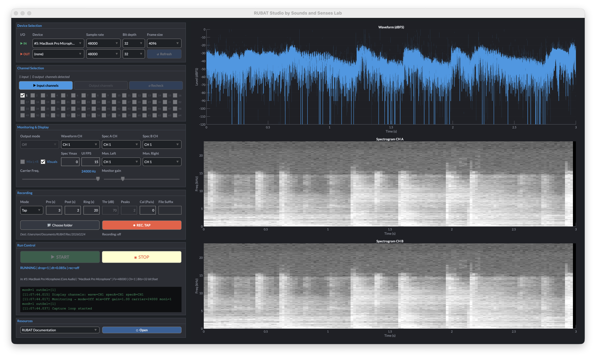

# RUBAT Studio

**Realtime Unified BioAcoustic Tool** — a MATLAB-based multichannel audio recorder with live heterodyne monitoring, dual spectrogram display, and flexible recording workflows.

Developed by [Sounds and Senses Lab](https://biosonix.io).

---

## Overview

RUBAT Studio is a standalone GUI application for high-sample-rate, multichannel audio capture and real-time monitoring. Originally designed for ultrasonic field bioacoustics (bat surveys, insect acoustics, bird vocalisations), it is equally suited for any multichannel recording scenario — from studio sessions to environmental monitoring.

The application is deployed as a standalone app via MATLAB Compiler, requiring only the free MATLAB Runtime — no MATLAB licence needed.

> **Pronunciation:** "Rue-BAT" — rhymes with "blue bat." IPA: `/ˈruː.bæt/`

---

  
   
  <strong><em>RUBAT Studio v4.0</em> — Record sounds across a wide range of audio bands using built-in or external audio interfaces. Installation packages are available for macOS and Windows.</strong>

---

## Key Features

### Recording Modes

| Mode | Description |
|------|-------------|
| **Tap** | One-shot clip from the ring buffer. Captures a configurable *pre-trigger* window (audio that already happened) plus a *post-trigger* window. |
| **Continuous** | Streams audio directly to a WAV file until manually stopped. Pre-trigger seconds are prepended from the ring buffer. |
| **Auto** | Threshold-triggered tap recording. Arm it and walk away — when the signal energy exceeds a configurable dB threshold with a minimum number of peaks in the pre-trigger window, a tap is fired automatically. Includes a cooldown period to avoid re-triggering. |

### Real-Time Monitoring

- **Heterodyne** — Multiplies the input signal against a sine carrier with phase-continuous accumulation across frames (no clicks at frame boundaries). Carrier frequency is adjustable up to the Nyquist limit via a slider.
- **Passthrough** — Routes selected input channels directly to the output with optional gain and mixing.
- **Off** — Monitoring disabled; recording continues unaffected.

Monitoring mode can be switched live during streaming without restarting the audio engine.

### Multichannel I/O

- Supports up to **64 input and 64 output channels** with per-channel selection checkboxes.
- One-to-one routing: each selected input channel maps to its corresponding physical output channel.
- **Mix mode** sums odd-indexed inputs to the left ear and even-indexed to the right for intuitive stereo headphone monitoring of microphone arrays.
- Dedicated **Mon. Left** and **Mon. Right** dropdowns for explicit monitor channel selection.

### Visualisation

- **Waveform display** — Scrolling level plot in dBFS (relative) or dB SPL re 20 µPa (when a calibration factor is provided). Auto-scaling Y-axis with 10 dB grid.
- **Dual spectrograms** — Two independent greyscale spectrogram panes (black → white), each assignable to any selected input channel. Adjustable upper frequency limit and FFT parameters adapted to the frame size.
- **Configurable UI FPS** — Plot refresh rate is user-adjustable (1–60 fps), automatically capped to the audio frame rate. Visuals can be disabled entirely to reduce CPU load.

### Calibration

Supply a **Pa-per-unit** sensitivity factor and the waveform switches to calibrated dB SPL. The Auto threshold then operates in dB SPL rather than relative dBFS — making thresholds consistent across sessions and microphone models.

### Device Handling

- Automatic enumeration of all PortAudio input/output devices at startup.
- **Refresh** button forces PortAudio re-initialisation for hot-plug/unplug detection.
- Robust open-probe fallback: steps through sample rates, channel counts, and device name variants until a working configuration is found.
- Same-device duplex detection (e.g., RME Babyface) with automatic Fs locking and coordinated buffer management.

### Output Format

- WAV files with timestamps: `YYYYMMDD_HHmmss_SSS[_suffix].wav`
- Bit depths: 16-bit PCM, 24-bit PCM, or 32-bit IEEE float — matching the input bit depth setting.
- Streaming WAV writer with proper RIFF header finalisation (safe against mid-write interruption).
- Default destination: `~/Documents/RUBAT/Rec/YYYYMMDD/`, configurable via folder picker.

---

## Requirements

- **MATLAB Runtime R2023b** (free) — bundled with the installer.
- No MATLAB licence required.
- macOS and Windows installers provided.

---

## Installation

1. Download the latest release from the [Releases](https://github.com/raviumadi/RUBAT-Recorder/releases) page.
2. Run the platform-specific installer:
   - **macOS:** Mount the `.dmg` and drag RUBAT Studio to Applications.
   - **Windows:** Run the `.exe` installer.
3. The MATLAB Runtime R2023b is installed automatically if not already present.

See the [Install Guide](https://rubat.biosonix.io/install/) for detailed step-by-step instructions.

---

## Quick Start

1. **Launch** RUBAT Studio.
2. **Click ↺ Refresh** to enumerate audio devices.
3. **Select an input device** from the dropdown — RUBAT will probe it and report available channels and sample rates.
4. *(Optional)* Select an **output device** for monitoring.
5. **Choose channels** using the input/output checkbox grids.
6. **Set recording parameters:**
   - Mode: Tap / Continuous / Auto
   - Pre-trigger and post-trigger durations
   - Ring buffer length
   - *(Auto mode)* Threshold (dB), minimum peaks, and calibration factor
7. **Press ▶ START** (or press `s`) to begin streaming.
8. **Monitor** using Heterodyne, Passthrough, or Off.
9. **Record:**
   - Tap mode: press ⏺ REC. TAP (or press `t`)
   - Continuous: press ⏺ to start, ⏹ to stop (or press `t` / `x`)
   - Auto: press ⏺ ARM Auto to arm, ⏹ DISARM to disarm
10. **Press ■ STOP** (or press `S`) to end the session.

---

## Keyboard Shortcuts

| Key | Action |
|-----|--------|
| `s` | Start streaming |
| `S` (shift+s) | Stop streaming |
| `t` | Trigger recording (tap / continuous start / auto arm) |
| `x` | Stop continuous recording |

---

## UI Layout

The interface is divided into two main areas:

### Left Panel (Controls)

| Panel | Purpose |
|-------|---------|
| **Device Selection** | Input/output device dropdowns, sample rate, bit depth, frame size |
| **Channel Selection** | Tabbed input/output channel grids (up to 64 channels), recheck button |
| **Monitoring & Display** | Output mode, waveform/spectrogram channel assignment, carrier frequency, monitor gain, mix controls, UI FPS, spectrogram Y-max |
| **Recording** | Mode selection, pre/post/ring durations, auto threshold & peaks, calibration factor, file suffix, folder picker, record button |
| **Run Control** | START/STOP buttons, status display, live event log |
| **Resources** | Links to documentation, lab website, papers, and GitHub |

### Right Panel (Visualisation)

- **Waveform** — Scrolling dBFS or dB SPL level plot.
- **Spectrogram A** — Assignable to any input channel.
- **Spectrogram B** — Assignable to any input channel.

---

## Configuration Defaults

| Parameter | Default |
|-----------|---------|
| Input sample rate | 192 kHz |
| Output sample rate | 48 kHz |
| Frame size | 4096 samples |
| Bit depth | 32-bit float |
| Pre-trigger | 3.0 s |
| Post-trigger | 2.0 s |
| Ring buffer | 20.0 s |
| Auto threshold | 70 dB |
| Auto min peaks | 2 |
| Waveform display | 3.0 s window |
| Spectrogram display | 3.0 s window |
| Spectrogram FFT | 2048-point (Hann window) |
| UI refresh rate | 15 fps |
| Heterodyne carrier | 45 kHz |
| Monitor gain | 1.0× |

---

## Architecture

Key design points:

- **Timer-free capture loop** — Audio frames are read in a tight loop, avoiding MATLAB timer overhead and jitter.
- **Ring buffer** — A pre-allocated circular buffer holds the last N seconds of all input channels for instant tap capture.
- **Streaming WAV writer** — Keeps the file handle open for continuous recording, finalising the RIFF header on close.
- **Resample on monitor path only** — Input-to-output sample rate conversion (e.g., 192 kHz → 48 kHz) is applied only to the monitoring path. Recordings are always written at the native input sample rate.
- **Same-device duplex handling** — When input and output share a physical device, RUBAT locks their sample rates together and coordinates buffer management automatically.

---

## Platform Notes

### macOS
- PortAudio runs in Core Audio shared mode — sample rate conversion is handled transparently by the OS. Select the rate matching your hardware's clock setting in its mixer app (e.g., RME TotalMix).
- A 300 ms pause is inserted after releasing audio devices to allow Core Audio to fully release the PortAudio port.

### Windows
- Destination folder resolution uses PowerShell to handle OneDrive-redirected Documents folders.
- Standard PortAudio/WASAPI behaviour applies.

---

## Documentation

Full documentation is available at **[rubat.biosonix.io](https://rubat.biosonix.io)**.

| Page | Description |
|------|-------------|
| [Quickstart](https://rubat.biosonix.io/quickstart/) | First recording in minutes |
| [Walkthrough](https://rubat.biosonix.io/walkthrough/) | Detailed panel-by-panel guide |
| [Calibration](https://rubat.biosonix.io/calibration/) | Setting up dB SPL display |
| [Tips](https://rubat.biosonix.io/tips/) | Best practices for field recording |
| [FAQ](https://rubat.biosonix.io/faq/) | Common questions |

---

## Citation

If you use RUBAT Studio in your research, please cite:

> Umadi, R. (2026). RUBAT Studio: Realtime Unified BioAcoustic Tool. Sounds and Senses Lab. https://github.com/raviumadi/RUBAT-Recorder

---

## License

RUBAT Studio is released under the [GNU General Public License v3.0](LICENSE.md).

Copyright © 2026 Ravi Umadi — Sounds and Senses Lab.

This software is provided "as is", without warranty of any kind. See [LICENSE.md](LICENSE.md) for full details.

---

## Links

- **Documentation:** [rubat.biosonix.io](https://rubat.biosonix.io)
- **Lab website:** [biosonix.io](https://biosonix.io)
- **GitHub:** [github.com/raviumadi/RUBAT-Recorder](https://github.com/raviumadi/RUBAT-Recorder)
